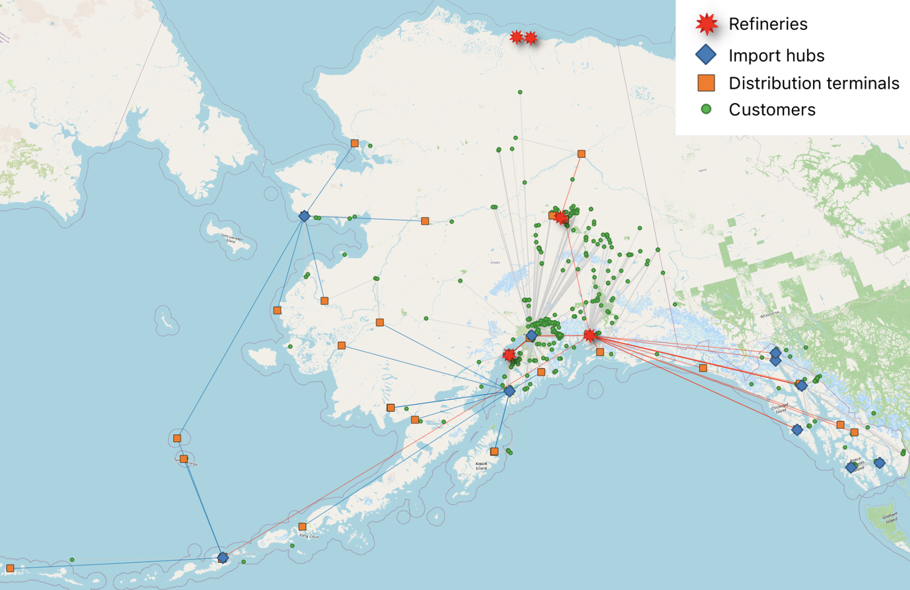

# Representative Alaska Refined-Fuel Network

This repository documents the data integration and network-construction
procedure used to represent Alaska's refined-fuel distribution system as a
three-tier network of suppliers, distribution terminals, and last-mile
locations. Its scope ends with the representative network; it does not include
the tri-level resilience model.



*Representative network showing refineries, marine import hubs, distribution
terminals, last-mile locations, and the constructed arcs.*

## Released network

The network contains:

- 16 suppliers: five refineries and 11 marine import hubs;
- 52 distribution terminals: 51 physical terminals and one representative
  Kuparuk terminal;
- 931 last-mile locations; and
- 1,022 constructed arcs: 61 supplier-to-terminal and 961
  terminal-to-last-mile arcs.

The arcs are plausible service relationships selected by the construction
model, not observed transactions or shipment routes.

## Repository structure

```text
assets/          Network figure
data/raw/        Preserved public-source files and extracts
data/processed/  Network-construction inputs and released arc tables
config/          Geographic and domain rules
docs/            Provenance, assumptions, and data definitions
notebooks/       Executable network-construction notebook
scripts/         File-integrity and released-network validation checks
```

The processed node tables are:

- `refineries.csv`
- `marine_import_hubs.csv`
- `distribution_terminals.csv`
- `last_mile_locations.csv`

`network_arcs.csv` is the canonical representative-network arc table. The two
stage-specific arc files contain the same arcs separated by network layer.

## Constructing the representative network

From the repository root:

```bash
python3 -m venv .venv
source .venv/bin/activate
python -m pip install --upgrade pip
python -m pip install -r requirements.txt
jupyter lab notebooks/construct_representative_alaska_network.ipynb
python scripts/validate_network.py
```

The reference network was constructed with Gurobi 12.0.3. Gurobi must be
installed and licensed separately, with `gurobi_cl` available on `PATH`. The
continuous flow model can have alternative optima; an equally optimal solution
may therefore select a different positive-flow arc set.

## Interpretation and provenance

- Tank storage is a demand proxy, not measured annual consumption.
- Refinery capacity, marine imports, and terminal storage are converted to
  allocation weights and normalized for network construction.
- Arc distance is WGS84 ellipsoidal distance, used as a transportation-cost
  proxy rather than a physical route length.
- Domain-informed restrictions are recorded in
  [`config/domain_rules.json`](config/domain_rules.json) and supported in
  [`docs/DOMAIN_RULE_EVIDENCE.md`](docs/DOMAIN_RULE_EVIDENCE.md).

The processed tables are the reproduction inputs. Preserved EIA, USACE, HIFLD,
ADEC, EPA UST Finder, and OpenStreetMap files provide source traceability. See
[`docs/PROVENANCE.md`](docs/PROVENANCE.md) for the transformation record.

`data/SHA256SUMS` contains fingerprints for the preserved source files. Run
`python scripts/check_source_hashes.py` to confirm that they have not changed.

## Citation and licensing

Citation metadata are in [`CITATION.cff`](CITATION.cff). Code is licensed under
the MIT License. Source-specific data terms, including OpenStreetMap attribution
and ODbL requirements, are summarized in [`DATA_LICENSE.md`](DATA_LICENSE.md).
